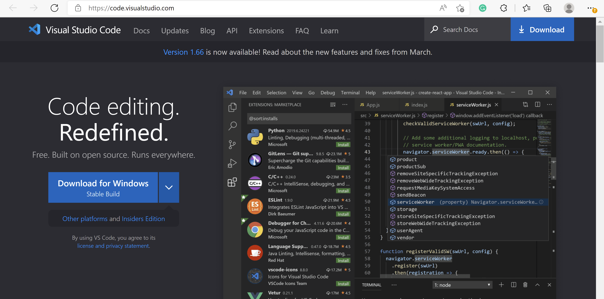
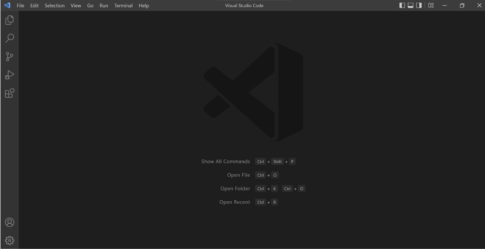
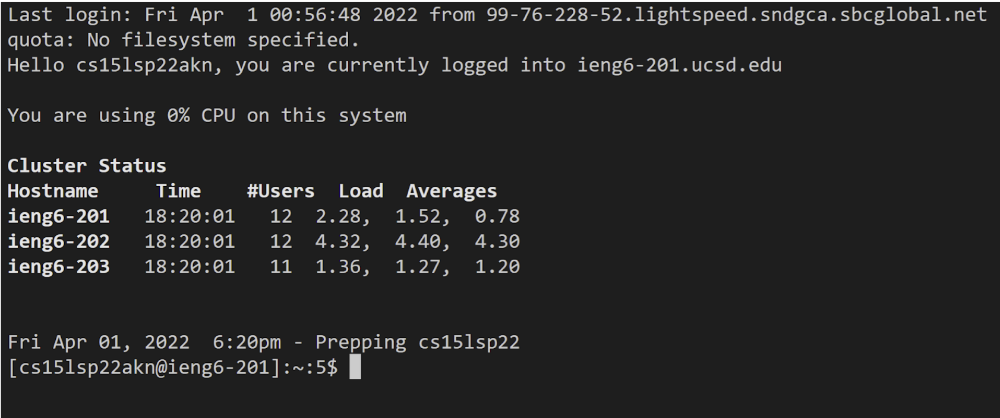
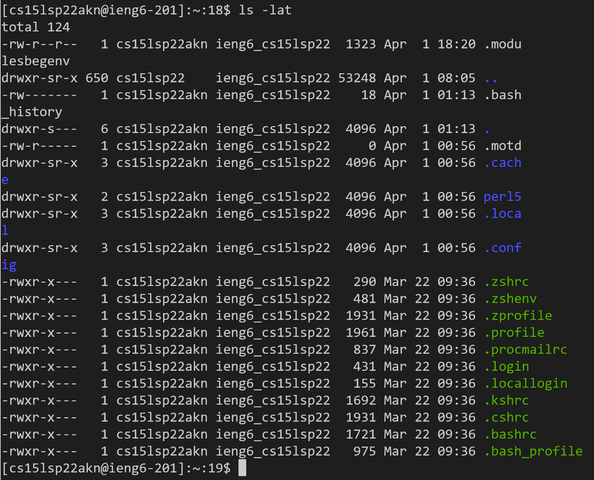
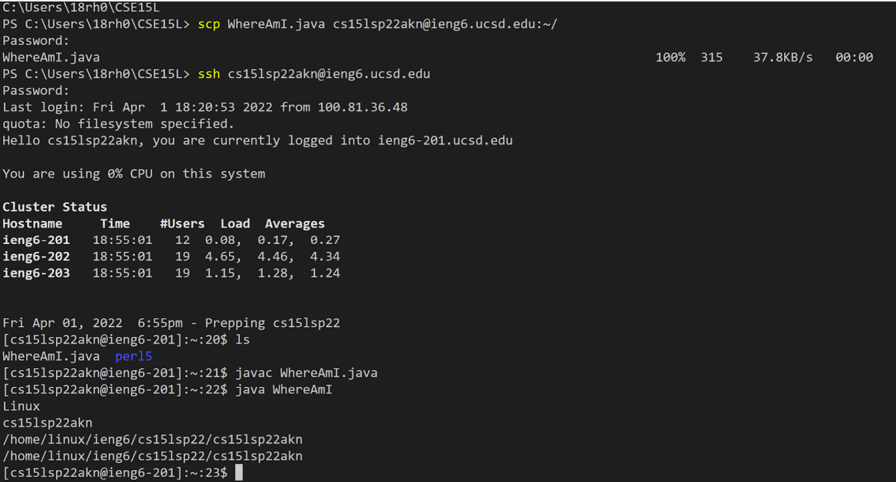
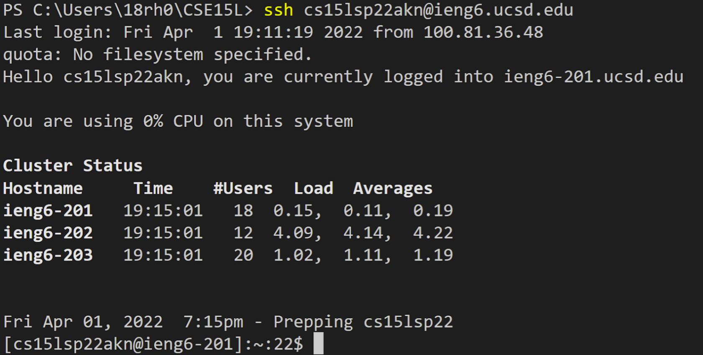
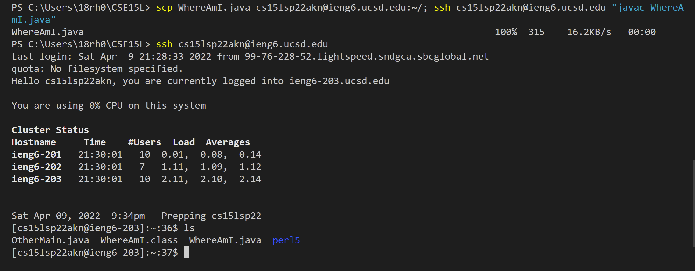

# Lab Report 1 Week 2

This tutorial will walk you through the steps to log into a course-specific account on the ieng6 server and how to copy a file from your local computer to a server computer.

---

## Step 1: Install VScode on your local computer

* Go to https://code.visualstudio.com/ to download and install VScode on your computer.
* If your computer has a linux or macOS system, click on the downward arrow on the blue button to download the correct version for your computer.

> *The website should look like this:*




> *You should see something like this when you open VScode:*



## Step 2: Remotely Connecting

* Open up a new terminal and enter the following command: `ssh cse15lsp22akn@ieng6.ucsd.edu`. Replace the part before @ with your own course-specific account.

* Enter yes when it asks you if you want to continue connecting.

* When prompted to type password, enter your password corresponding to your course-specific account.

>*After you successfully log in, your terminal should look like this:*



* You are now connected to a server computer!

## Step 3: Trying some commands

* There are many commands you could try running on your computer and the server computer (through your terminal).

* Here are some to try:
    * `cd`
    * `cd ~`
    * `ls` 
    * `ls -lat`
    * `cat /home/linux/ieng6/cs15lsp22/public/ hello.txt`
* I tried the `ls -lat `command which lists files in the directory in long listing format, sorted from newest to oldest.



* Log out of the server for now by typing   `exit` in the terminal.

## Step 4: Moving files with command **scp**

* To copy a file from your computer to the server, run the command: `scp WhereAmI.txt cse15lsp22akn@ieng6.ucsd.edu:~/`.

* Make sure that you are in the directory where your file is located (Use `cd` to change directory if needed). Replace WhereAmI.txt with the file you are trying to copy and the username with your own username.

* Enter your password when prompted.

> *When you log into the server again, you can check if your file is in the server diretory by typing **ls**.*



## Step 5: Setting an SSH Key

* By generating an SSH key, you can save time by not having to type in your password everytime when you try to log in to the server and copy files.

* Below are the commands you need to enter to generate the key. Be careful because you have to swith back and forth between the client and the server.

```
# On client

$ ssh-keygen

// When this line shows up
Enter file in which to save the key (/Users/<user-name>/.ssh/id_rsa): 

// copy and paste what's in the parentheses and enter

// hit enter when it asks for a passphrase
```

```
# On server
$ mkdir .ssh
```

```
# On client
$ scp /Users/<user-name>/.ssh/id_rsa.pub cs15lsp22akn@ieng6.ucsd.edu:~/.ssh/authorized_keys
```

> *When you log into the server again, you shouldn't need to type your password.*



## Step 6: Optimizing Remote Running

* To further simplify and speed up the remote-running process, you can combine multiple commands into one line by using semicolons.
* For instance, this line allows you to copy the file from client to server and compiling it on the server:  `scp WhereAmI.java cs15lsp22akn@ieng6.ucsd.edu:~/; ssh cs15lsp22akn@ieng6.ucsd.edu "javac WhereAmI.java"`

(Tip: quotation marks around command to be run on the server)

>
