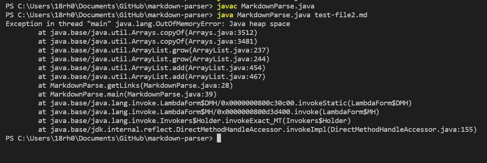
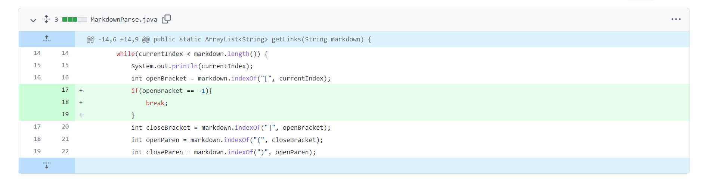
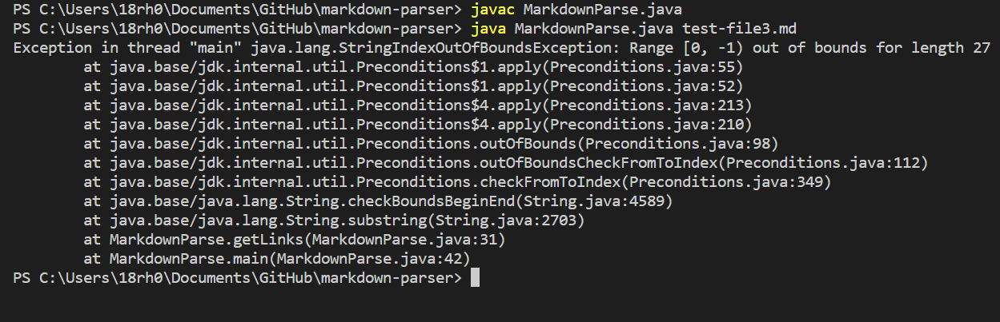
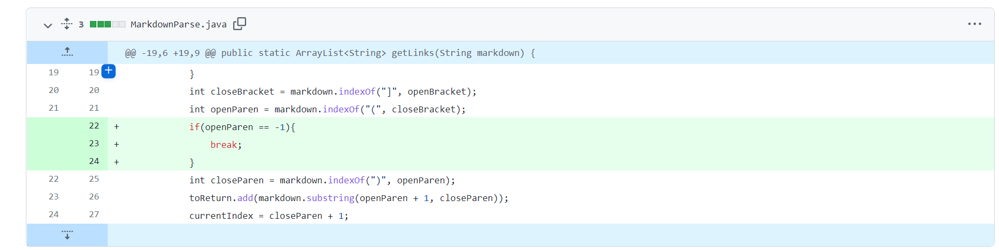
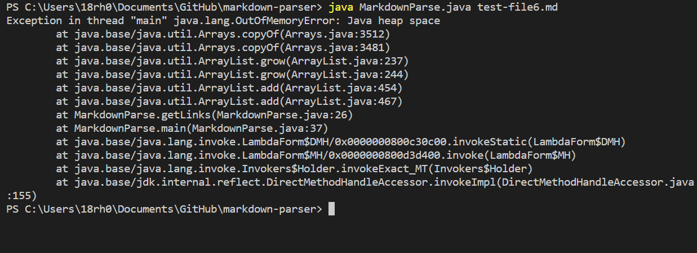
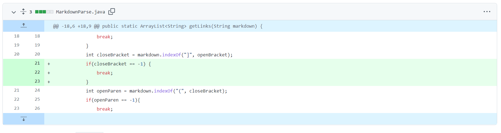

# __Lab Report 2__

This lab report discusses the bugs encountered in MarkdownParser.java and how they are fixed so that the program would be able to handle more edge cases and not crash.

## Change 1:
*Symptom*: [Test file 2](https://github.com/Rena2025/markdown-parser/edit/main/test-file2.md) caused the program to be stuck in an infinite loop.

*Fix*:

This symptom was caused by the program's inability to break when the next open bracket was not found. Test file 1 had an extra empty line at the end which caused the program to continue search for the next open bracket until all the memory was taken up. To fix this problem, a break statement was added so when the open bracket is not found, the program will end.

## Change 2:
*Symptom*: [Test file 3](https://github.com/Rena2025/markdown-parser/edit/main/test-file3.md) caused the program to throw a `StringOutOfBoundsException` when it was executed.

*Fix*:

The exception was thrown because the `indexOf` method cannot create a substring from a negative index (or when the integer for the second parameter is smaller than the first parameter). This was solved by adding a break statement if an `openParen` is not found, so the program won't continue to the next line where the index of `openParen` was used (in this case -1). Therefore, a link with out parenthesis won't create an error.

## Change 3:
*Symptom*: [Test file 6](https://github.com/Rena2025/markdown-parser/edit/main/test-file6.md) also resulted in an infinite loop.

*Fix*:

The symptom was caused by the program not able to process an extra open bracket at the end of the file. The extra bracket caused the program to keep searching for a close bracket, which didn't exist. The fix was to add a break statement to end the program if a close bracket was not found.
