# Lab Report 3 

## Part 1: Streamlining ssh Configuration
* Create a file called *config* in the `.ssh` folder if it doesn't yet exist. 
* Put the following lines into the *config* file using Notepad or any other code editor like VScode.
* The host name can be anything, but I chose to remain with ieng6.
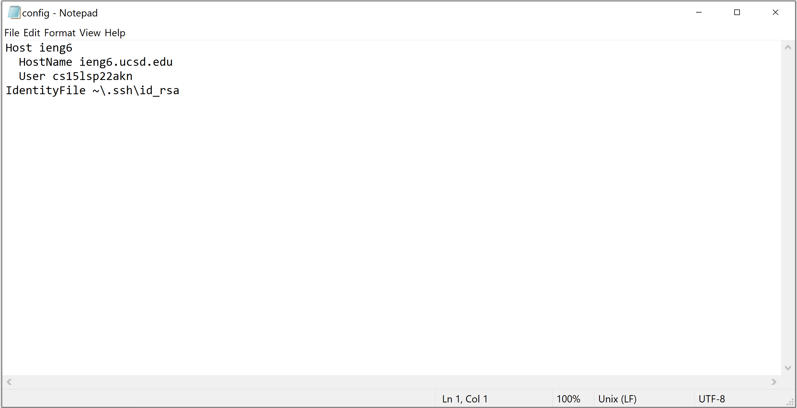

* Then log into the ieng6 account with the command `ssh ieng6`. Now no account name and password are required to log into my course.
.png)

* Then using the `scp` command, copy a file from the local computer to the server computer's home directory. Use `ls` to check that the file exists in the server's home directory.
.png)

## Part 2: Setup Github Access from ieng6
* Generated an ssh key on my ieng6 account. Both the private and public keys are stored in the `.ssh` directory in my account.
.png)

* Added ssh key to my github account.
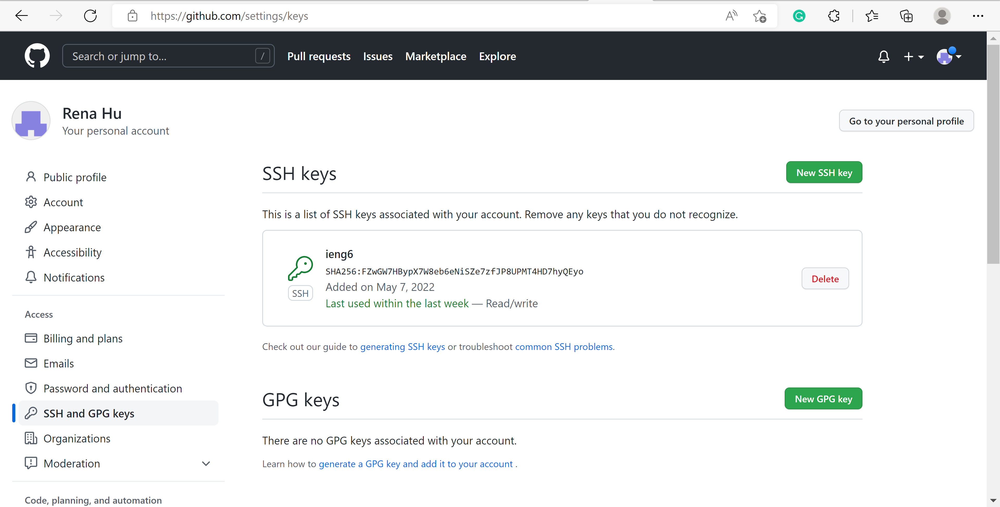
* Added a new file to my markdown-parser repo through using git commands on my ieng6 account.
.png)
.png)
This is the commit link on Github.com. [Commit](https://github.com/Rena2025/markdown-parser/blob/main/test-file9.md)

## Part 3: Copy whole directories with `scp -r`
* Copying the markdown-parser directory from my local computer to the ieng6 computer.
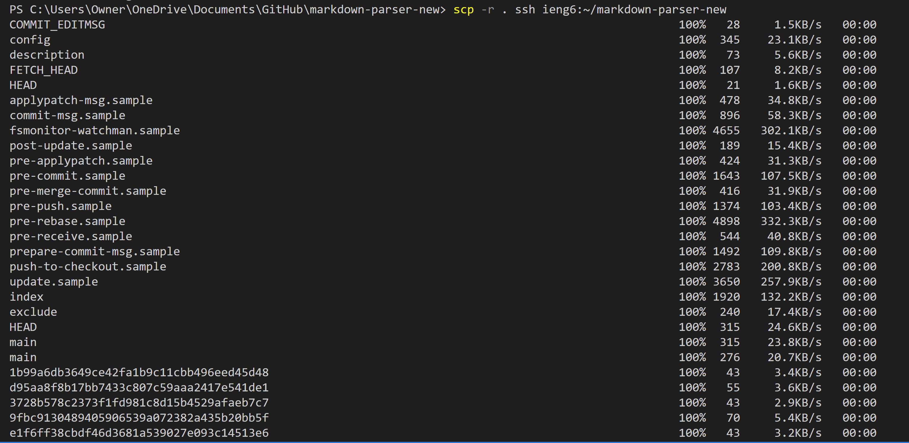
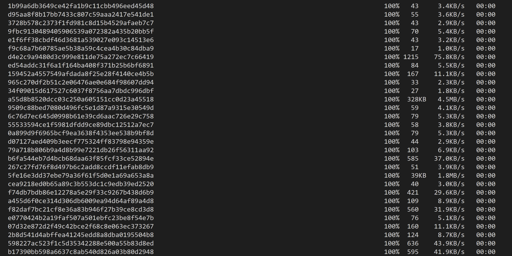
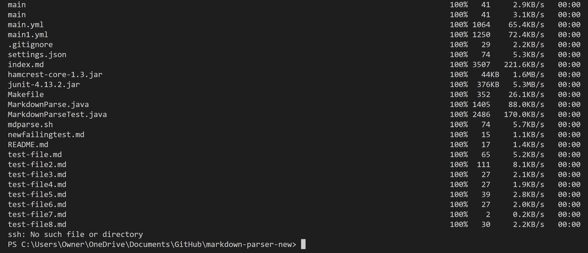

* Compiling and running the tests on the ieng6 account.
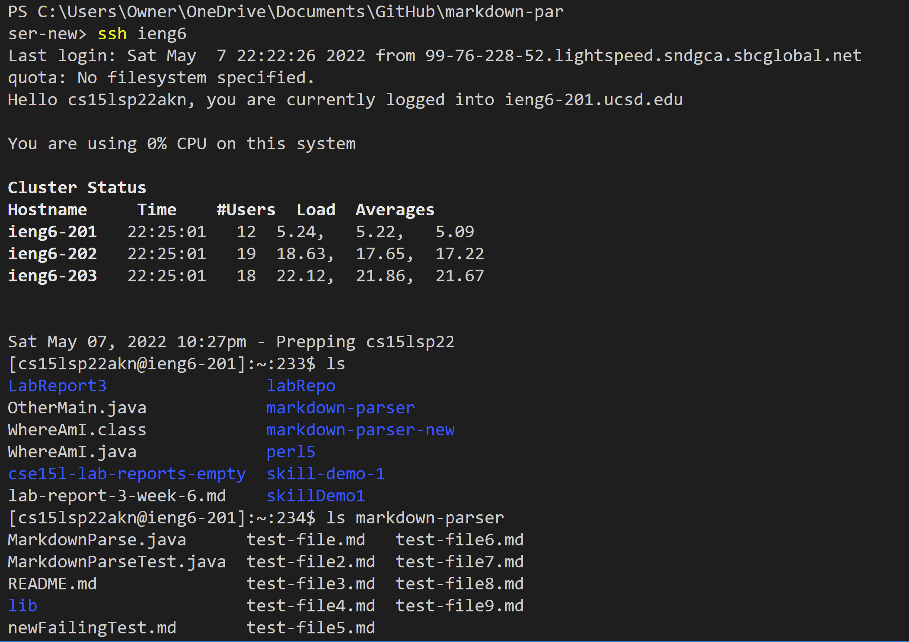
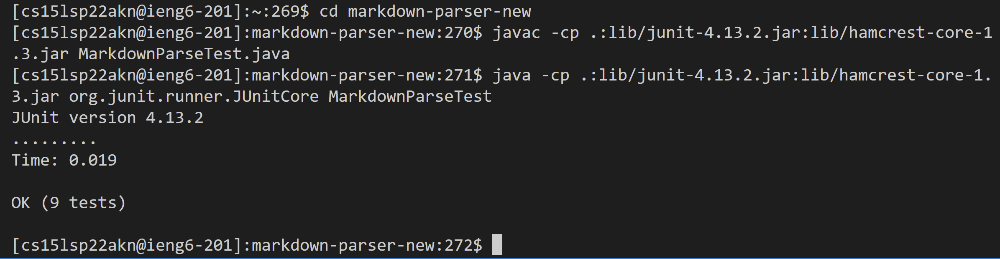

* Copying the directory and running the tests on the server by combining the commands all in one line on the local machine.
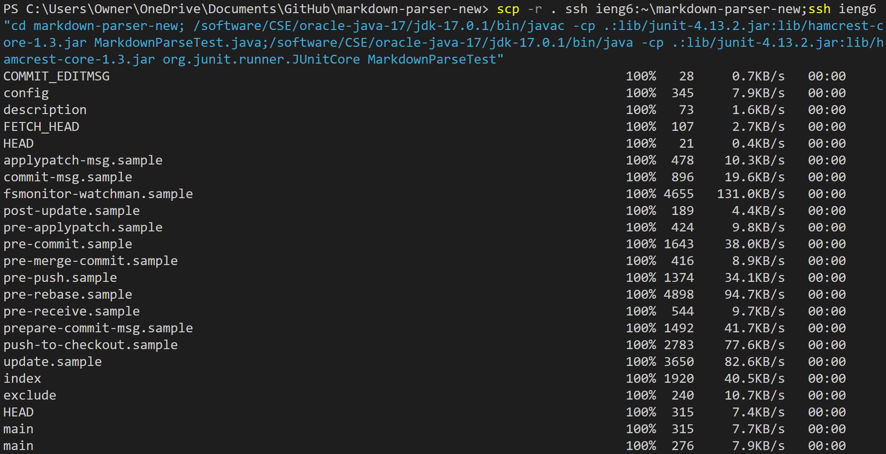
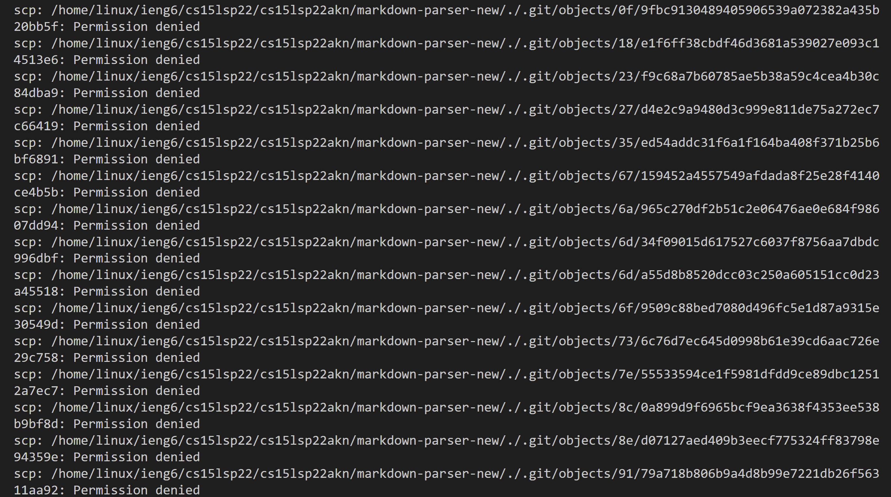
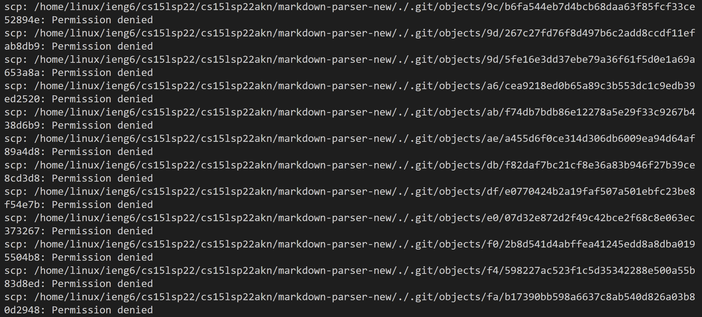
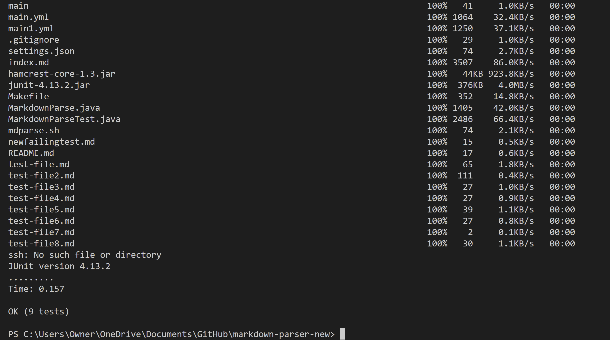

