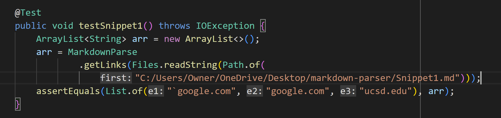
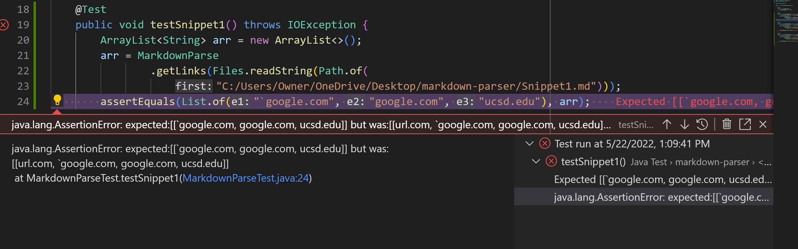
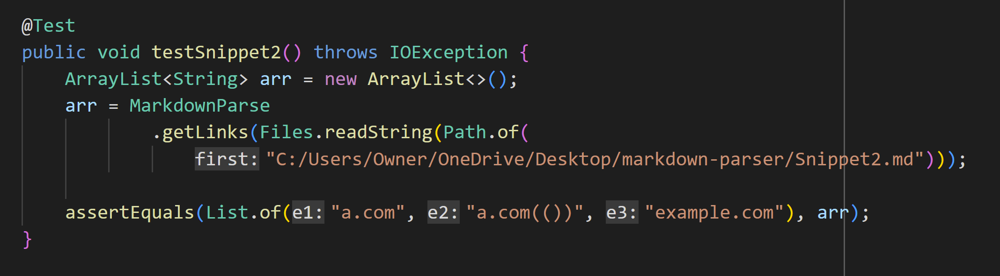
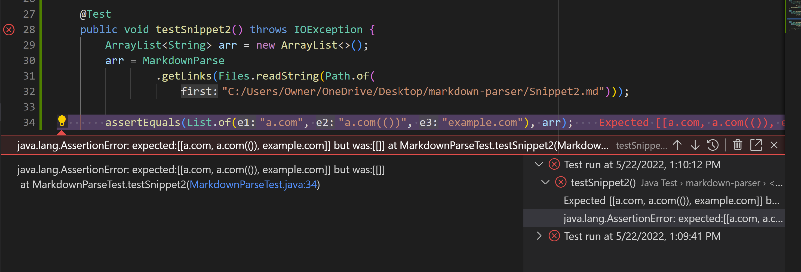
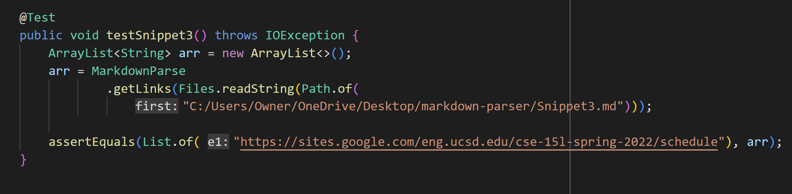
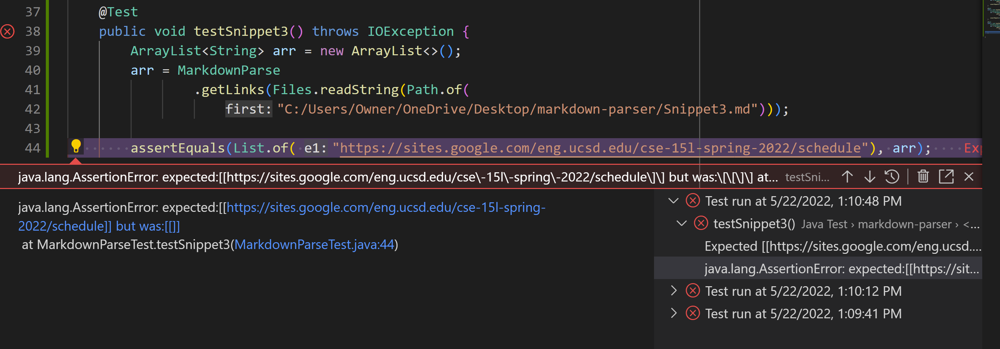

# Lab Report 4

This lab report talks about how to use junit to debug `MarkdownParser.java` through writing junit tests for edge cases.

Links to my repo and the reviewed repo:
* [my MarkdownParse repo](https://github.com/Rena2025/markdown-parser-new)
* [reviewed MarkdownParse repo](https://github.com/ayushs2725/markdown-parser)

## Snippet 1
* Preview on VScode: 
* Expected output: [`google.com, google.com, ucsd.edu]

* My junit test:

* My implementation did not pass the junit test:

* Reviewed repo's junit test:

* Reviewed repo's implementation also did not pass the junit test:

* Possible solution: Since my implemenation worked for all the links except the first one, I need to focus on that case. When there is a back tick right in front of the open bracket, search for the next open bracket and update `openBracket` with the index of the most recent open bracket found so the first link can be skipped.

## Snippet 2
* Preview on VScode: 
* Expected output: [a.com, a.com(()), example.com]

* My junit test:

* My implementation did not pass the junit test:

* Reviewed repo's junit test:

* Reviewed repo's implementation also did not pass the junit test:

* Possible solution: Since my implemenation worked for all the links except the second one, I need to focus on that case. The error was generated because my implementation wrongly recorded the index of the first close parenthesis instead of the third one, so I could use a while loop to find the index of the last close parenthesis of this link. In other words, if the character at `closeParen + 1 == ')'`, then I increment the index of closeParen, given that the index don't go out of bounds. 

## Snippet 3
* Preview on Commonmark: 
* Expected output: [https://sites.google.com/eng.ucsd.edu/cse-15l-spring-2022/schedule]

* Junit test:

* My implementation did not pass the junit test:

* Reviewed repo's junit test:

* Reviewed repo's implementation also did not pass the junit test:

* Possible solution: Whenever there are more than one line breaks between the open and close brackets, the program should skip that link and go to the next set of open and close brackets because the format is invalid. Similarly, whenever there are more than one line breaks (consecutive) between the open and close parentheses, the program should not count what's inside the parentheses as a link. This might be difficult to achieve in 10 lines because there are many variables to update.

