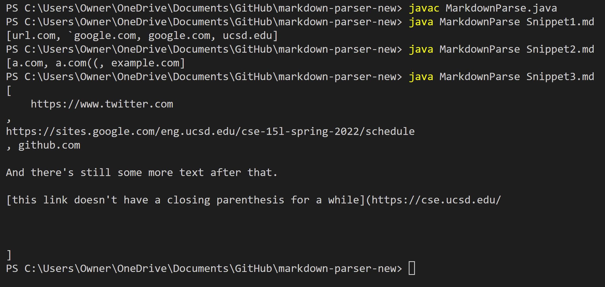
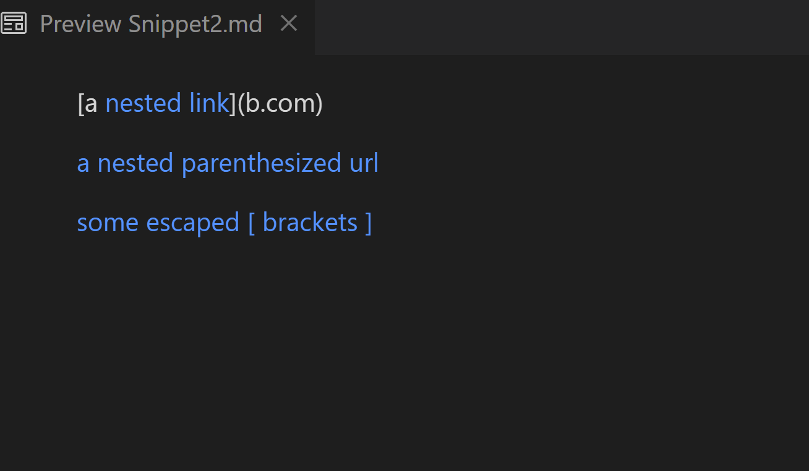

# Lab Report 4

Links to my repo and the reviewed repo:
* [my MarkdownParse repo](https://github.com/Rena2025/markdown-parser-new)
* [reviewed MarkdownParse repo](https://github.com/ayushs2725/markdown-parser)

* output from running the snippets on my original repo

## Snippet 1
* Preview on VScode: 
* Expected output: [`google.com, google.com, ucsd.edu]

* Junit test:

* My implementation did not pass the junit test:

## Snippet 2
* Preview on VScode: 
* Expected output: [a.com, a.com(()), example.com]

* Junit test:

* My implementation did not pass the junit test:

## Snippet 3
* Preview on Commonmark: 
* Expected output: [https://sites.google.com/eng.ucsd.edu/cse-15l-spring-2022/schedule]

* Junit test:

* My implementation did not pass the junit test:

