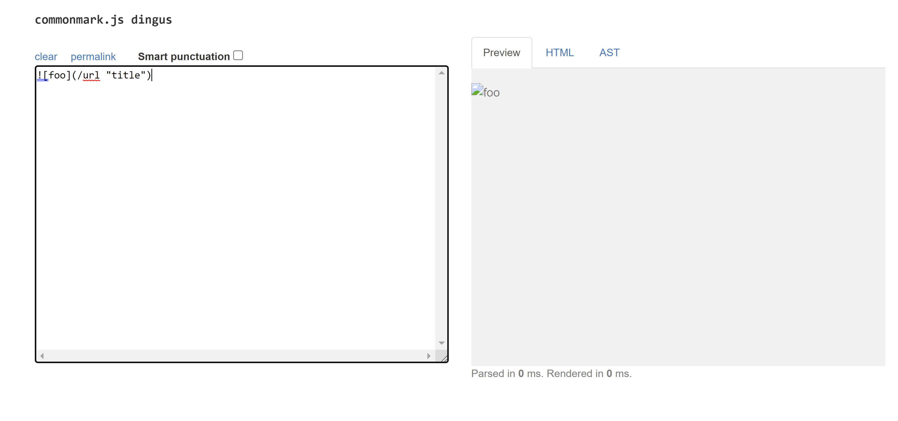

# Lab Report 5

## Test 1 
* I used Vimdiff to compare the text files produced from running script.bash on both implementations in order to see for which test files the two implementations produced different results.

* File: [571.md](https://github.com/nidhidhamnani/markdown-parser/blob/main/test-files/571.md)
* The given implementation produced the correct output. My implementation produced the wrong output.
* expected output: []

* Bug: Since the test file contains an image, there are no valid links. However, my code still treated the image as if it were a link. My code should have had an if statement that checks to make sure that there is no exclamation mark at the beginning of the line, before the open bracket. Since my code never checks for the exclamation mark, a variable should be added before the openBracket to keep track of the index of an exclamation mark, and an if statement should be added to check if a exclamation mark comes before the open bracket.

## Test 2
* I used Vimdiff to compare the text files produced from running script.bash on both implementations in order to see for which test files the two implementations produced different results.
* File: [503.md](https://github.com/nidhidhamnani/markdown-parser/blob/main/test-files/503.md)

* correct implementation is
* expected output: ["title"]

* The given implementation produced the correct output and mine produced the wrong output.
* Bug: My code threw an exception for this case when it should have considered the given link in the test file as a valid link and included it in the output. This error might be caused by these two chunks of code that I added in order to account for extra parenthesis and line breaks in the link. This might have caused the index to go out of bound which would throw an exception. To fix this, I need to delete these two chunks of code. 

